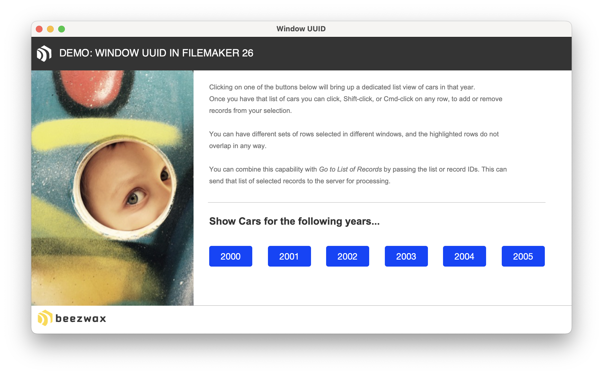
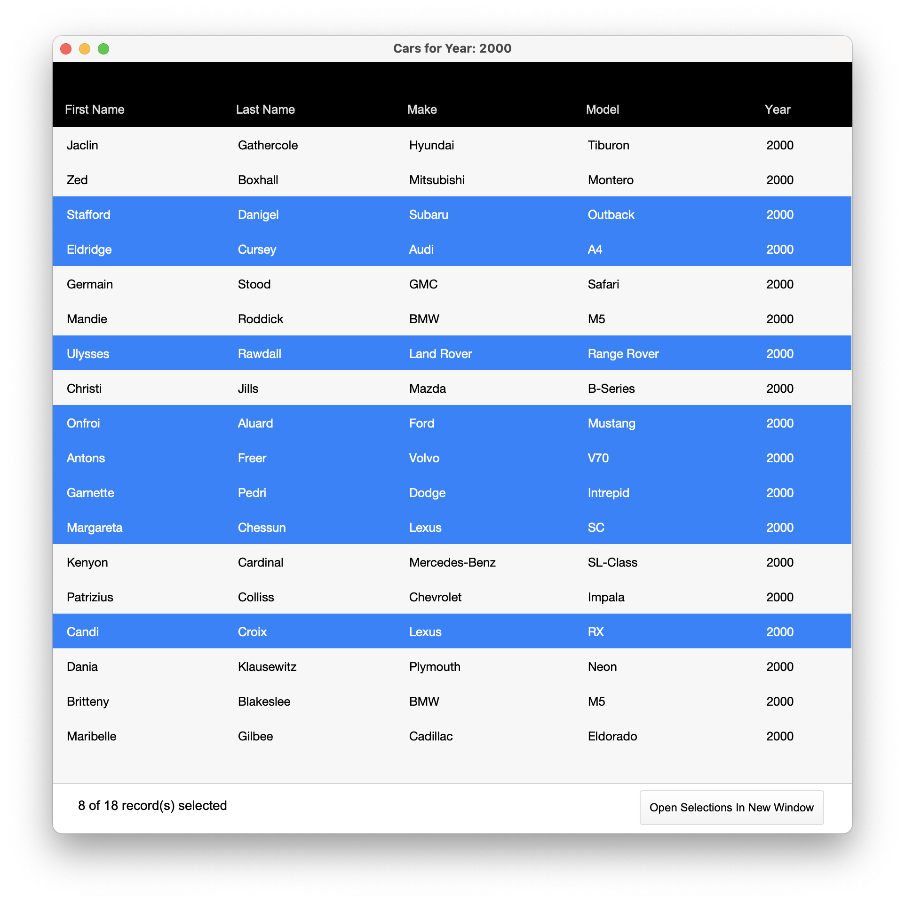

# window-UUID
This example explores what becomes possible with Get ( WindowUUID ). It enables window variables, something we have done in the past but this makes it easy and elegant. Understanding how to create, update and delete them is what this example illustrates.

## Access
The credentials to access this file are admin/admin

## The Example file
Small example that allows you to open multiple windows and Shift-Click or Cmd-Click to select or deselect multiple records. What we do is store the Record IDs into a child attribute of the Window UUID this way we can have the UI inform the user of which records have been selected. Thus maintaining that list of selected records independanty in each window.

Then when you are ready you can transfer those IDs to the server to find them and process them.

Bonus Points with what this enables is the ability to continually have access to those window variables - independeant of layout context. Thus giving us some new super powers.

